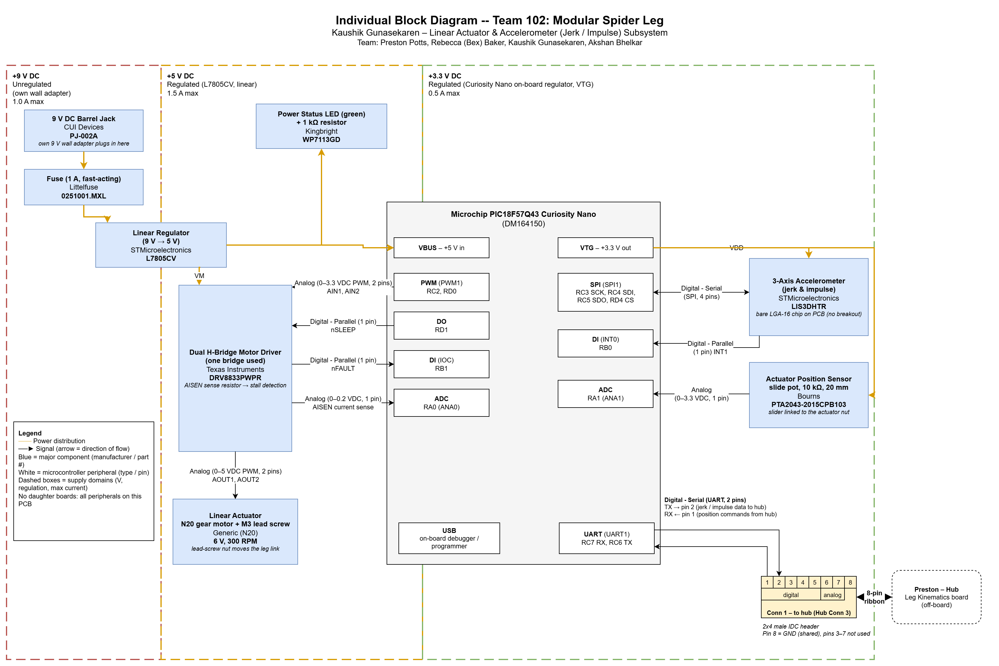

## Overview

This page shows the electrical architecture of my subsystem for Team 102's Modular Spider Leg. In the team's hub-and-spoke layout, my board is the spoke on **hub connector 3**. It drives the leg's small **linear actuator** (the actuator) and measures leg motion with an **accelerometer** for jerk and impulse sensing (the sensor). Commands come from Preston's hub board over the ribbon cable.

The design follows the [RAS 304 project requirements](https://ras-embedded-systems.pages.dev/304/course-info/project-description/):

* PIC18F57Q43 Curiosity Nano as the microcontroller.
* A 9 V barrel jack feeding a 5 V **linear** regulator, with a fuse and a power-status LED.
* A 2x4 male IDC header using the class ribbon pinout.
* No daughter boards: every peripheral, including the accelerometer, is placed directly on this PCB.

Parts were also chosen to stay within the team's $60&ndash;70 total budget.

The block diagram shows:

* **Power levels:** my own 9 V adapter &rarr; barrel jack &rarr; fuse &rarr; L7805 linear regulator (5 V) for the motor driver, the actuator motor, and the Curiosity Nano. The Curiosity Nano's on-board regulator supplies 3.3 V to the accelerometer and the position potentiometer.
* **Actuator:** an N20 gear motor with an M3 lead screw, driven by a TI DRV8833 H-bridge. A current-sense resistor allows stall detection.
* **Position feedback:** a Bourns slide potentiometer whose slider moves with the actuator's lead-screw nut.
* **Sensor:** an ST LIS3DH 3-axis accelerometer chip on SPI, with a data-ready interrupt.
* **Team connection:** an 8-pin ribbon cable to Preston's hub board. It carries position commands in and jerk/impulse data out over UART.

## Block Diagram

  
**Figure 1:** Individual block diagram for the linear actuator and accelerometer subsystem.

[Download the draw.io source file](individual-block-diagram.drawio)

## Major Components and Cost

| Function | Manufacturer | Part Number | Supply | Approx. Cost |
|---|---|---|---|---|
| Microcontroller | Microchip | PIC18F57Q43 Curiosity Nano (DM164150) | 5 V (VBUS) | Course kit |
| Linear actuator | Generic | N20 gear motor, 6 V, 300 RPM, with M3 lead-screw shaft | 5 V | ~$8 |
| Motor driver (H-bridge) | Texas Instruments | DRV8833PWPR | 5 V (VM) | $2.34 |
| Position sensor | Bourns | PTA2043-2015CPB103 (10 k&Omega; slide pot, 20 mm travel) | 3.3 V | ~$1.60 |
| Accelerometer (bare chip) | STMicroelectronics | LIS3DHTR | 3.3 V | ~$2 |
| Linear regulator (9 V &rarr; 5 V) | STMicroelectronics | L7805CV | 9 V in | ~$0.60 |
| Fuse (1 A, fast-acting) | Littelfuse | 0251001.MXL | 9 V | ~$1 |
| Barrel jack | CUI Devices | PJ-002A | 9 V | ~$1 |
| Power status LED (green) + 1 k&Omega; resistor | Kingbright | WP7113GD | 5 V | ~$0.30 |
| 2x4 IDC header, sense resistor, capacitors | &mdash; | &mdash; | &mdash; | ~$1.50 |
| 9 V wall adapter | &mdash; | &mdash; | &mdash; | Already owned |
| **Total (new purchases)** | | | | **~$18.50** |

This is roughly my even share of the $60&ndash;70 team budget ($15&ndash;17.50). Buying the N20 lead-screw motor from a lower-cost supplier (about $5&ndash;6) brings the total to about $16.

## Power Domains

| Domain | Regulation | Max Current | Source | Loads |
|---|---|---|---|---|
| +9 V DC | Unregulated | 1.0 A | My 9 V wall adapter, through the barrel jack and a 1 A fuse | L7805CV input |
| +5 V DC | Regulated (linear) | 1.5 A | ST L7805CV | DRV8833 (VM) and N20 motor, Curiosity Nano (VBUS), power LED |
| +3.3 V DC | Regulated | 0.5 A | Curiosity Nano on-board regulator (VTG pin) | LIS3DHTR, slide potentiometer |

The L7805CV will need a small heatsink: at a 0.6 A motor load it dissipates about (9 V &minus; 5 V) &times; 0.6 A &asymp; 2.4 W.

## Microcontroller Peripherals and Pins

| Peripheral | PIC18F57Q43 Pin(s) | Connected To | Signal (Type, Pins) |
|---|---|---|---|
| PWM (PWM1) | RC2, RD0 | DRV8833 AIN1, AIN2 | Analog (0&ndash;3.3 VDC PWM, 2 pins) |
| DO | RD1 | DRV8833 nSLEEP | Digital - Parallel (1 pin) |
| DI (interrupt-on-change) | RB1 | DRV8833 nFAULT | Digital - Parallel (1 pin) |
| ADC | RA0 (ANA0) | DRV8833 AISEN sense resistor | Analog (0&ndash;0.2 VDC, 1 pin) |
| ADC | RA1 (ANA1) | Slide potentiometer wiper | Analog (0&ndash;3.3 VDC, 1 pin) |
| SPI (SPI1) | RC3 SCK, RC4 SDI, RC5 SDO, RD4 CS | LIS3DHTR | Digital - Serial (SPI, 4 pins) |
| DI (INT0) | RB0 | LIS3DHTR INT1 (data ready) | Digital - Parallel (1 pin) |
| UART (UART1) | RC7 RX, RC6 TX | Ribbon connector pins 1 and 2 | Digital - Serial (UART, 2 pins) |
| USB | On-board debugger | PC (programming / debugging) | USB |

The DRV8833 drives the motor through AOUT1 and AOUT2: Analog (0&ndash;5 VDC PWM, 2 pins).

## Team Connection

My board connects to Preston's hub board (Leg Kinematics) through **hub connector 3**, using the class-standard 8-pin ribbon cable and a 2x4 male IDC header. The ribbon carries signals and a shared ground only; my board is powered by its own 9 V adapter.

| Pin | Type | Signal | Direction | MCU Pin |
|:---:|---|---|---|---|
| 1 | Digital | UART RX: position commands from the hub | Hub &rarr; my board | RC7 (U1RX) |
| 2 | Digital | UART TX: jerk / impulse data to the hub | My board &rarr; hub | RC6 (U1TX) |
| 3&ndash;5 | Digital | Not used | &mdash; | &mdash; |
| 6&ndash;7 | Analog | Not used | &mdash; | &mdash; |
| 8 | GND | Common ground | &mdash; | GND |

## Design Notes

* **Closed-loop position control:** the hub sends a target position over UART. The PIC compares it with the slide-pot reading on RA1, then drives the two PWM outputs (RC2, RD0) to move the lead screw forward or back.
* **Stall and fault protection (Req. 6.1):** current through the DRV8833 flows through a 0.2 &Omega; sense resistor on AISEN. The PIC reads that voltage on RA0 and stops the motor if the current stays high, which indicates a stall. The same resistor also sets the driver's built-in current limit at about 1 A. The nFAULT pin (RB1) reports over-current or over-temperature, and the PIC then disables the driver through nSLEEP (RD1).
* **Jerk and impulse sensing:** the LIS3DH data-ready interrupt (RB0) triggers an SPI read of acceleration at up to about 1.3 kHz. Jerk is found by differentiating acceleration, and impulse by integrating force (mass &times; acceleration) over the foot-contact time. The results are sent to the hub over UART.
* **Accelerometer soldering:** the LIS3DHTR is a 3 &times; 3 mm LGA-16 package. Because daughter boards aren't allowed, it is soldered directly to the PCB with a stencil and hot air or reflow.
* **Speed vs. cost:** an M3 lead screw moves 0.5 mm per turn, so a 300 RPM motor gives about 2.5 mm/s at full speed. That is slow, but adequate for a small demonstration leg, and much cheaper than a commercial linear actuator with built-in feedback (about $80 or more).
